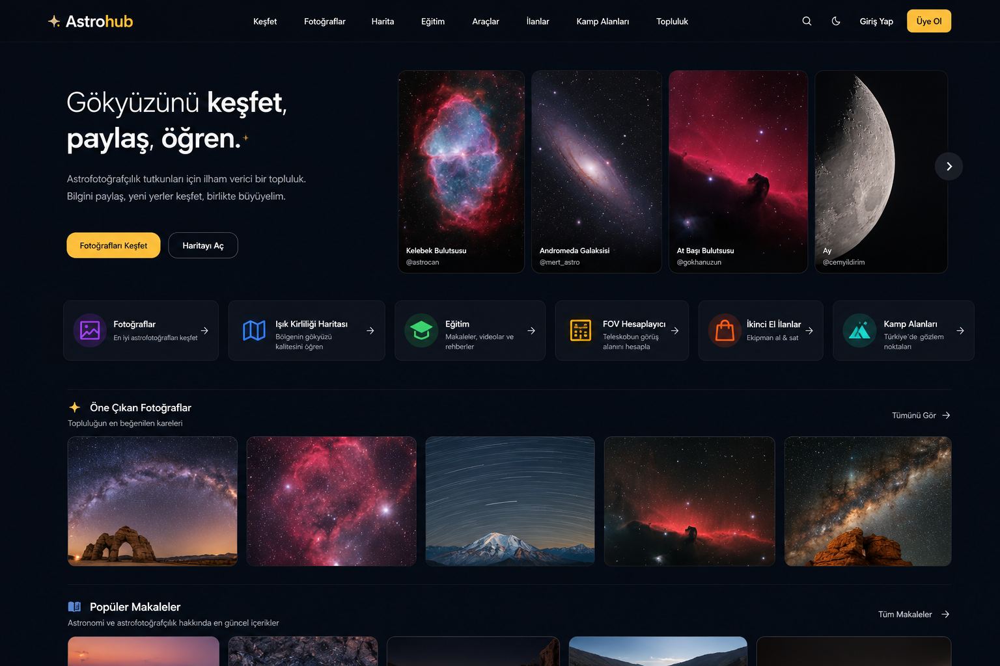
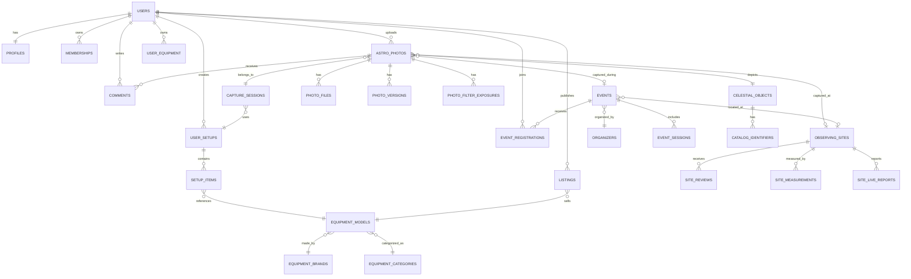
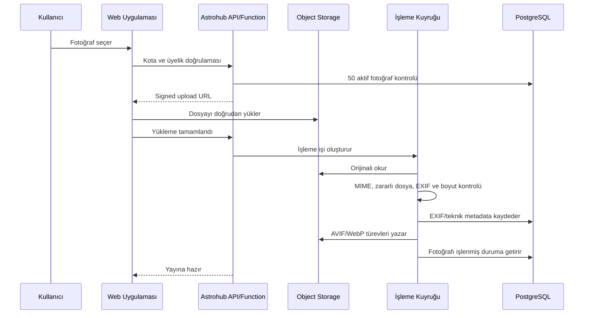
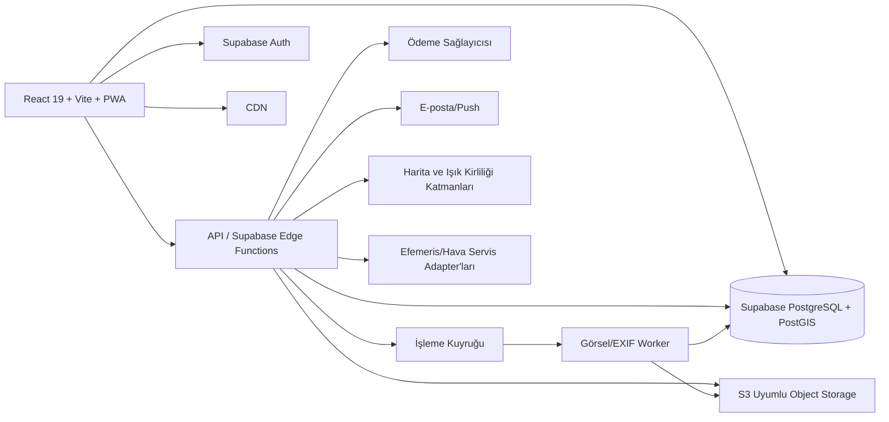

# Astrohub — Ürün, UI/UX ve Teknik Mimari Şartnamesi

**Doküman sürümü:** 1.0  
**Tarih:** 14 Temmuz 2026  
**Proje:** Astrohub  
**Temel kaynak:** `stagehub-v1-0-1-main.zip` statik kod incelemesi ve onaylanan Astrohub ana sayfa tasarımı



---

## İçindekiler

1. [Yönetici özeti](#1-yönetici-özeti)
2. [StageHub altyapı incelemesi ve yeniden kullanım kararı](#2-stagehub-altyapı-incelemesi-ve-yeniden-kullanım-kararı)
3. [Ürün vizyonu ve temel ilkeler](#3-ürün-vizyonu-ve-temel-ilkeler)
4. [Tek üyelik modeli, kullanıcı rolleri ve yetkiler](#4-tek-üyelik-modeli-kullanıcı-rolleri-ve-yetkiler)
5. [Bilgi mimarisi ve ana navigasyon](#5-bilgi-mimarisi-ve-ana-navigasyon)
6. [UI/UX tasarım sistemi](#6-uiux-tasarım-sistemi)
7. [Sayfa bazlı UI tasarım şartnamesi](#7-sayfa-bazlı-ui-tasarım-şartnamesi)
8. [Fonksiyonel modüller](#8-fonksiyonel-modüller)
9. [Veri modeli](#9-veri-modeli)
10. [Fotoğraf, EXIF ve depolama mimarisi](#10-fotoğraf-exif-ve-depolama-mimarisi)
11. [Teknik mimari](#11-teknik-mimari)
12. [StageHub kodunun dönüştürülme planı](#12-stagehub-kodunun-dönüştürülme-planı)
13. [Admin paneli](#13-admin-paneli)
14. [Harici veri ve servis entegrasyonları](#14-harici-veri-ve-servis-entegrasyonları)
15. [Güvenlik, KVKK, telif ve moderasyon](#15-güvenlik-kvkk-telif-ve-moderasyon)
16. [Arama, SEO, PWA, erişilebilirlik ve performans](#16-arama-seo-pwa-erişilebilirlik-ve-performans)
17. [Test, gözlemlenebilirlik ve operasyon](#17-test-gözlemlenebilirlik-ve-operasyon)
18. [Fazlandırılmış geliştirme planı](#18-fazlandırılmış-geliştirme-planı)
19. [Kabul kriterleri](#19-kabul-kriterleri)
20. [Önerilen URL yapısı](#20-önerilen-url-yapısı)
21. [Önerilen proje klasör yapısı](#21-önerilen-proje-klasör-yapısı)
22. [Kritik kararlar ve kapsam sınırları](#22-kritik-kararlar-ve-kapsam-sınırları)

---

# 1. Yönetici özeti

Astrohub; Türkiye merkezli, ancak teknik yapısı uluslararası genişlemeye uygun bir **astronomi, astrofotoğrafçılık, astrocamping, karanlık gökyüzü, ekipman, eğitim, etkinlik ve topluluk portalı** olarak tasarlanacaktır.

Platformun temel farkı, birbirinden kopuk içerik sayfaları oluşturmak yerine aşağıdaki verileri ilişkilendirmesidir:

- Astrofotoğraf
- Fotoğrafçı ve kullanıcı profili
- Astronomik hedef
- Çekim tarihi ve koşulları
- Çekim lokasyonu
- Kullanılan ekipman seti
- Filtre ve kalibrasyon bilgileri
- Kamp/gözlem noktası
- Astronomi etkinliği
- Eğitim içeriği
- İkinci el ilanı

Bir kullanıcı bir astrofotoğrafa baktığında yalnızca görseli değil; hedefi, entegrasyon süresini, optik sistemi, kamerayı, filtreleri, kalibrasyon karelerini, çekim noktasını, gökyüzü koşullarını, işleme yöntemini ve aynı hedefin başka kullanıcılarca çekilmiş örneklerini de görebilecektir.

Bir kullanıcı bir etkinliğe baktığında ise etkinlik programını, kamp koşullarını, gökyüzü kalitesini, Ay durumunu, hava tahminini, çekilebilecek hedefleri, katılımcı toplulukları ve etkinlik sırasında çekilen fotoğrafları aynı yapı içerisinde görebilecektir.

## Ana ürün kararı

Astrohub’da **tek bir ücretli üyelik paketi** bulunacaktır. Plus/Pro gibi katmanlar olmayacaktır. Aylık ve yıllık ödeme seçenekleri sunulsa bile sağlanan fonksiyonlar aynı olacaktır.

Üyelik kapsamında kullanıcı:

- En fazla **50 aktif yayımlanmış astrofotoğraf** bulundurabilir.
- Birden fazla ekipman ve hazır setup oluşturabilir.
- Etkinliklere katılabilir ve yetkisi varsa etkinlik yayımlayabilir.
- Kamp/gözlem noktası ekleyebilir ve değerlendirebilir.
- İkinci el ilanı verebilir.
- Fotoğraflara yorum yapabilir, koleksiyon oluşturabilir ve kullanıcı takip edebilir.
- Gözlem ve çekim planları oluşturabilir.
- Eğitim içeriklerine erişebilir.

## Ana teknik karar

StageHub’ın ön yüz, kimlik doğrulama, yönetim, bildirim, mesajlaşma, ilan, etkinlik, harita, PWA ve Supabase altyapısı önemli ölçüde yeniden kullanılacaktır. Ancak:

- StageHub veritabanı ve yüz adetlik migration geçmişi Astrohub’a taşınmamalıdır.
- Yeni bir Astrohub Supabase projesi kurulmalıdır.
- Yeni, temiz ve konsolide bir başlangıç şeması hazırlanmalıdır.
- Fotoğraf dosyaları için yalnızca Supabase Storage’a bağımlı kalınmamalıdır.
- Büyük medya hacmi nedeniyle S3 uyumlu nesne depolama ve CDN katmanı tasarlanmalıdır.

---

# 2. StageHub altyapı incelemesi ve yeniden kullanım kararı

## 2.1 İncelenen mevcut yapı

ZIP içerisindeki proje statik olarak incelenmiştir. Mevcut yapı yaklaşık olarak:

- 173 TypeScript/TSX dosyası
- 28.790 satır TypeScript/TSX kodu
- 100 Supabase migration dosyası
- 7.922 satır migration SQL kodu
- 12 Supabase Edge Function
- 12 MB civarında çıkarılmış proje boyutu
- 9,2 MB civarında public asset
- 3 adet otomatik test dosyası

barındırmaktadır.

### Mevcut teknoloji yığını

- React 19
- TypeScript
- Vite 6
- Tailwind CSS 4
- Radix UI / shadcn tabanlı bileşen sistemi
- React Router 7
- TanStack Query
- Supabase Auth
- PostgreSQL / Supabase Database
- Supabase Storage
- Supabase Edge Functions
- Leaflet / React Leaflet
- PWA, push notification ve offline sayfa
- SEO meta yapısı ve JSON-LD
- E-posta kuyruğu ve bildirim altyapısı
- Admin paneli
- RLS politikaları ve audit log altyapısı

## 2.2 Doğrudan yeniden kullanılabilecek parçalar

Aşağıdaki yapılar Astrohub için yüksek oranda yeniden kullanılabilir:

| StageHub yapısı | Astrohub karşılığı | Yeniden kullanım seviyesi |
|---|---|---:|
| AppShell, Topbar, Footer, Theme | Astrohub genel kabuğu | Yüksek |
| AuthContext ve auth sayfaları | Tek üyelik girişi/kayıt | Yüksek |
| Supabase istemcisi ve provider yapısı | Astrohub backend erişimi | Yüksek |
| AdminLayout ve admin bileşenleri | Astrohub yönetim paneli | Yüksek |
| NotificationBell ve bildirim tercihleri | Etkinlik, yorum, gökyüzü uyarıları | Yüksek |
| Mesajlaşma altyapısı | Üye/organizatör iletişimi | Orta-Yüksek |
| Follow/Favorite sistemi | Kullanıcı, hedef, etkinlik, lokasyon takibi | Orta-Yüksek |
| Reviews bileşenleri | Kamp noktası ve ekipman değerlendirmeleri | Orta-Yüksek |
| Listing modülü | İkinci el astronomi pazaryeri | Yüksek |
| Event modülü | Türkiye astronomi etkinlikleri | Orta-Yüksek |
| Leaflet harita bileşenleri | Işık kirliliği ve astrocamping haritası | Orta |
| Image upload UI kabuğu | Astrofotoğraf yükleme sihirbazı | Orta |
| SEO altyapısı | Hedef, şehir, etkinlik ve kamp sayfaları | Yüksek |
| PWA/push yapısı | Kamp sahasında mobil ve offline kullanım | Yüksek |
| Audit/error log altyapısı | Operasyon ve güvenlik | Yüksek |
| E-posta kuyruğu | Üyelik ve etkinlik bildirimleri | Yüksek |

## 2.3 Dönüştürülmesi gereken parçalar

| Mevcut yapı | Gerekli dönüşüm |
|---|---|
| Müzisyen/grup keşif ekranları | Astrofotoğrafçı, kulüp, organizatör ve ekipman keşfi |
| Stüdyo/mekân yapısı | Kamp/gözlem noktası, rasathane, planetaryum ve bilim merkezi |
| Rezervasyon yapısı | Etkinlik katılımı ve isteğe bağlı kontenjan kaydı |
| Ekipman ana tablosu | Kategori bazlı kapsamlı astronomi ekipman veritabanı |
| Görsel işleme | EXIF’i silmeden önce okuyan, orijinali koruyan sunucu taraflı pipeline |
| StageHub ana sayfası | Kabul edilen sade Astrohub editoryal ana sayfası |
| İlan kategorileri | Montür, optik tüp, kamera, filtre, aksesuar vb. |
| Etkinlik veri modeli | Astronomi programı, kamp, gökyüzü ve kaynak takibi alanları |
| Profil rolleri | Üye, doğrulanmış organizatör, kulüp yöneticisi, editör, admin |

## 2.4 Kaldırılması gereken parçalar

- Stüdyo oda rezervasyonları
- Müzik mekânı masa rezervasyonları
- Müzisyen ve grup ilan türleri
- Sahnede/konser programı yapısı
- Press kit/EPK’ye özgü alanlar
- Müzik enstrümanı rolleri
- StageHub’a ait seed içerikleri ve görseller
- StageHub marka adı, domain, metadata ve e-posta şablonları
- Astrohub’da karşılığı olmayan venue/studio iş akışları

## 2.5 Kritik teknik uyarılar

### 1. Yeni veritabanı kurulmalı

StageHub’ın yüz migration dosyasını olduğu gibi Astrohub’a uygulamak, kullanılmayan onlarca tablo ve karmaşık politika mirası oluşturur. Önerilen yaklaşım:

1. StageHub kodu yeni bir Astrohub repository’sine fork edilir.
2. Mevcut Supabase migration geçmişi arşivlenir.
3. Astrohub için yeni Supabase projesi açılır.
4. Yalnızca gerekli desenlerden yararlanılarak konsolide migration’lar yazılır.
5. İlk canlı sürümden itibaren migration geçmişi temiz biçimde sürdürülür.

### 2. Mevcut görsel pipeline Astrohub için uygun değil

StageHub istemci tarafında görselleri WebP’ye çevirirken EXIF verisini temizlemektedir. Astrohub’da tam tersine:

- EXIF önce okunmalı ve normalize edilmelidir.
- Kullanıcıya hangi bilgilerin yayımlanacağı gösterilmelidir.
- GPS verisi varsayılan olarak gizli tutulmalıdır.
- Orijinal dosya özel depoda saklanabilir.
- Kamuya açık türevlerde EXIF temizlenmelidir.

### 3. Repository hijyeni

Mevcut handoff ve geliştirme belgelerinde gerçek kimlik bilgisi veya parola benzeri hassas içerik bulunma riski vardır. Astrohub fork’u hazırlanırken:

- Hassas bilgiler repository geçmişinden temizlenmeli,
- Kullanılmış parolalar döndürülmeli,
- Secrets yalnızca güvenli ortam değişkenlerinde tutulmalı,
- Handoff belgelerinde gerçek hesap bilgisi bulunmamalıdır.

### 4. Test kapsamı artırılmalı

Mevcut projede test sayısı ürün kapsamına göre düşüktür. Astrohub başlamadan önce temel auth, RLS, yükleme, kota, ödeme ve moderasyon akışları için test stratejisi kurulmalıdır.

---

# 3. Ürün vizyonu ve temel ilkeler

## 3.1 Ürün tanımı

> **Astrohub, Türkiye’nin astronomi, astrofotoğrafçılık, gözlem etkinlikleri, karanlık gökyüzü ve astrocamping platformudur.**

## 3.2 Ürün hedefleri

- Türkiye’deki astronomi ve astrofotoğrafçılık topluluklarını tek portalda toplamak.
- Türkiye’deki tüm güvenilir astronomi etkinliklerini merkezi takvimde yayımlamak.
- Astrofotoğrafları teknik çekim verileriyle birlikte arşivlemek.
- Kamp ve gözlem noktalarını astronomik kriterlerle değerlendirmek.
- Güncel astronomi ekipmanlarını standart bir veritabanında toplamak.
- Ekipman uyumluluğu, FOV ve çekim planlama araçları sunmak.
- Güvenilir ikinci el ekipman pazaryeri oluşturmak.
- Başlangıçtan ileri seviyeye eğitim merkezi sunmak.
- Yurttaş bilimi ve karanlık gökyüzü ölçüm projelerine altyapı sağlamak.

## 3.3 Tasarım ve ürün ilkeleri

1. **Fotoğraf odaklı ama yalnızca galeri olmayan yapı**  
   Görsel önde, teknik veri erişilebilir ve düzenli olmalıdır.

2. **Dashboard olmayan ana sayfa**  
   Ana sayfada yoğun metrik kutuları, çok sayıda küçük widget ve kurumsal yönetim paneli hissi bulunmamalıdır.

3. **Türkiye’ye özel bağlam**  
   Şehirler, kamp noktaları, etkinlikler, gökyüzü koşulları ve yerel topluluklar önceliklidir.

4. **Veri kaynağı şeffaflığı**  
   Etkinlik, ışık kirliliği, ekipman ve gökyüzü verilerinin kaynağı ve güncellenme tarihi tutulmalıdır.

5. **Konum mahremiyeti**  
   Kullanıcı çekim noktasını tam, yaklaşık veya yalnızca bölge seviyesinde paylaşabilmelidir.

6. **Teknik doğruluk**  
   FOV, pixel scale, entegrasyon, filtre süresi ve gökyüzü hesapları mümkün olduğunca otomatik hesaplanmalıdır.

7. **Mobil saha kullanımı**  
   Kamp ve gözlem koşullarında düşük bağlantıyla kullanılabilen PWA yaklaşımı korunmalıdır.

8. **Modüler servis mimarisi**  
   Harita, hava, ödeme, depolama ve efemeris servisleri sağlayıcı bağımlılığını azaltan adapter katmanlarıyla kullanılmalıdır.

---

# 4. Tek üyelik modeli, kullanıcı rolleri ve yetkiler

## 4.1 Üyelik modeli

Astrohub’da yalnızca **Astrohub Üyeliği** vardır. Üyelik işlev bakımından tek pakettir.

Aylık veya yıllık ödeme seçenekleri bulunabilir; ancak iki ödeme döneminin sağladığı haklar aynıdır.

### Üyelik hakları

- 50 aktif yayımlanmış astrofotoğraf
- En fazla 10 geçici taslak fotoğraf
- Sınırsız ekipman envanteri
- Sınırsız hazır setup
- Sınırsız koleksiyon ve gözlem listesi
- Kamp/gözlem noktası ekleme ve yorumlama
- İkinci el ilanı verme
- Fotoğraf yorumlama, beğenme ve kaydetme
- Etkinliklere katılım kaydı
- Takip, bildirim ve mesajlaşma
- Eğitim içeriklerine erişim
- Kişisel profil ve portfolyo bağlantısı

## 4.2 50 fotoğraf kotasının tanımı

- Kota, **aktif yayımlanmış fotoğraf** adedini sayar.
- Taslaklar ayrı ve sınırlı bir geçici kotada tutulur.
- Silinen fotoğraf kota açar.
- Arşivlenen fotoğrafın kota kullanıp kullanmadığı ürün ayarıyla belirlenir; öneri, arşivlenen fotoğrafın kotada sayılmasıdır.
- Aynı fotoğrafın revizyonları ayrı fotoğraf sayılmaz; aynı fotoğraf kaydının sürümleri olarak tutulur.
- Yükleme yarıda kalırsa dosya geçici alana alınır ve otomatik temizlenir.
- Kota sadece ön yüzde değil, sunucu tarafında ve veritabanı fonksiyonunda doğrulanır.

## 4.3 Üyelik süresi sona erdiğinde

Önerilen davranış:

1. Kullanıcıya önceden e-posta ve uygulama bildirimi gönderilir.
2. Üyelik bittiğinde yeni yükleme ve ilan verme durdurulur.
3. 14 günlük ödemesiz süre tanınır.
4. Bu sürede profil ve içerikler yayında kalır.
5. Süre sonunda fotoğraflar silinmez; yalnızca arşivlenir veya görünürlüğü sınırlandırılır.
6. Üyelik yenilenince içerikler yeniden etkinleştirilebilir.

Kalıcı silme, ancak kullanıcı talebi veya açık veri saklama politikasıyla yapılmalıdır.

## 4.4 Kullanıcı rolleri

Üyelik planı ile rol birbirinden ayrılmalıdır.

| Rol | Açıklama |
|---|---|
| Ziyaretçi | Herkese açık içerikleri görüntüler. |
| Üye | Tek ücretli üyelik haklarına sahiptir. |
| Doğrulanmış organizatör | Etkinlik yayımlama ve katılımcı yönetme yetkisi alır. |
| Kulüp/kurum yöneticisi | Kurumsal profil ve ekip üyelerini yönetir. |
| İçerik editörü | Makale, video, hedef ve etkinlik içeriklerini düzenler. |
| Moderatör | Yorum, fotoğraf, ilan ve raporları inceler. |
| Admin | Sistem ve yetki yönetimi yapar. |

Doğrulanmış organizatör ve kulüp yöneticisi ayrı üyelik paketi değildir; admin tarafından verilen yetkidir.

---

# 5. Bilgi mimarisi ve ana navigasyon

## 5.1 Masaüstü üst menü

Önerilen ana menü:

- **Keşfet**
- **Fotoğraflar**
- **Etkinlikler**
- **Harita**
- **Eğitim**
- **Araçlar**
- **İkinci El**

Sağ bölüm:

- Arama
- Tema seçimi
- Bildirimler
- Giriş yap / profil menüsü
- Üye değilse **Üye Ol** butonu

## 5.2 Menü grupları

### Keşfet

- Bu Gece Gökyüzünde
- Astronomik Hedefler
- Astrofotoğrafçılar
- Kulüpler ve Topluluklar
- Rasathaneler ve Planetaryumlar
- Yeni İçerikler

### Harita

- Işık Kirliliği Haritası
- Kamp ve Gözlem Noktaları
- Etkinlik Haritası
- Astronomi Tesisleri
- Canlı SQM / All-Sky İstasyonları

### Araçlar

- FOV Hesaplayıcı
- Pixel Scale Hesaplayıcı
- Mosaic Planlayıcı
- Setup Uyumluluk Kontrolü
- Gözlem ve Çekim Planlayıcı
- Ay ve Astronomik Karanlık Takvimi

## 5.3 Mobil navigasyon

Mobilde yedi ana menüyü üstte sıkıştırmak yerine:

- Alt navigasyonda: Ana Sayfa, Fotoğraflar, Etkinlikler, Harita, Profil
- Diğer modüller: “Daha Fazla” çekmecesinde
- Yükleme işlemi profil veya ortadaki belirgin “+” aksiyonu üzerinden

kurgulanmalıdır.

---

# 6. UI/UX tasarım sistemi

## 6.1 Kabul edilen görsel yön

Ana tasarım referansı:

- Koyu lacivert/siyah zemin
- Büyük, ferah ve editoryal yerleşim
- Tam genişlikte fotoğraflı banner bulunmaması
- Sol tarafta kısa ürün mesajı
- Sağ tarafta dikey astrofotoğraf seçkisi
- Hızlı erişim modüllerinin tek satır hâlinde verilmesi
- Fotoğraf galerilerinin geniş görsel kartlarla gösterilmesi
- Dashboard benzeri yoğun metrik ve küçük kutu kullanımından kaçınılması

## 6.2 Renk sistemi

Önerilen temel token’lar:

```css
--background: #050a12;
--surface-1: #0a111d;
--surface-2: #0f1826;
--surface-3: #162235;
--foreground: #f7f8fb;
--muted-foreground: #9ca9ba;
--border: rgba(255,255,255,.10);
--primary: #f4b82f;
--primary-hover: #ffca4c;
--primary-foreground: #090b0f;
--link: #8db8ff;
--success: #45c985;
--warning: #ffb84d;
--danger: #ef6464;
```

Sarı/amber Astrohub marka vurgusu olarak kullanılmalıdır. Modül ikonlarında mavi, mor, yeşil veya turkuaz tonlar sınırlı biçimde kullanılabilir; ancak sayfanın genelinde çok renkli dashboard görünümü yaratılmamalıdır.

## 6.3 Tipografi

- Ana font: Inter veya benzer okunaklı sans-serif
- Başlıklar: 600–700 ağırlık
- Gövde: 400–500
- Teknik değerler: tabular numerals destekli font özelliği
- Çok uzun başlıklar iki satırla sınırlandırılmalı
- Teknik etiketler küçük ama en az 12 px olmalı

## 6.4 Grid ve genişlik

- Maksimum içerik genişliği: 1440–1520 px
- Masaüstü dış boşluk: 32–48 px
- Tablet: 24 px
- Mobil: 16 px
- Bölümler arası dikey boşluk: 64–96 px
- Kart aralığı: 16–24 px

## 6.5 Kart tasarımı

- İnce ve düşük kontrastlı border
- Hafif radius: 12–16 px
- Ağır gölge yerine yüzey farkı
- Hover’da küçük translate veya border vurgusu
- Fotoğraf kartlarında metin görseli boğmamalı
- Teknik bilgi kartlarında bilgi hiyerarşisi net olmalı

## 6.6 UI yoğunluğu kuralları

Ana sayfada:

- Yan yana en fazla 5 büyük içerik kartı
- Bir bölümde en fazla bir ana CTA
- Mini istatistik kutuları kullanılmamalı
- Harita, FOV veya filtre formları ana sayfaya tam işlevli gömülmemeli
- “Tümünü gör” bağlantıları sağ üstte sade biçimde bulunmalı

Yönetim ve üye panelinde daha yoğun dashboard yapısı kullanılabilir; ancak kamuya açık sayfalarda editoryal sadelik korunmalıdır.

## 6.7 Erişilebilirlik

- WCAG AA kontrast hedefi
- Klavye ile tam kullanım
- Görsel kartlarda anlamlı alt metin
- Harita ve grafikler için metinsel alternatif
- Focus ring hiçbir temada kaldırılmamalı
- Renk tek başına durum göstergesi olmamalı
- Hareket azaltma tercihi desteklenmeli

---

# 7. Sayfa bazlı UI tasarım şartnamesi

## 7.1 Ana sayfa

### Bölüm sırası

1. Üst navigasyon
2. Editoryal giriş alanı
3. Hızlı erişim modülleri
4. Yaklaşan astronomi etkinlikleri
5. Öne çıkan astrofotoğraflar
6. Bu gece gökyüzünde
7. Popüler eğitim içerikleri
8. Karanlık gökyüzü ve kamp noktaları
9. Yeni ikinci el ilanları
10. Topluluk ve kulüp çağrısı
11. Footer

### Editoryal giriş alanı

Sol sütun:

- “Gökyüzünü keşfet, paylaş, öğren.” benzeri kısa başlık
- İki satırı geçmeyen açıklama
- “Fotoğrafları keşfet” birincil CTA
- “Etkinlikleri gör” veya “Haritayı aç” ikincil CTA

Sağ sütun:

- Dört dikey astrofotoğraf kartı
- Fotoğraf adı ve kullanıcı adı
- Yatay kaydırma veya kontrollü carousel
- Otomatik geçiş zorunlu değil; kullanıcı kontrolü tercih edilir

### Yaklaşan etkinlikler

Etkinlikler ana sayfada öne alınmalıdır. Kartlarda:

- Tarih
- Etkinlik adı
- Şehir
- Etkinlik türü
- Ücretsiz/ücretli etiketi
- Kamp yapılabilir etiketi
- Kapak görseli

bulunmalıdır.

### Bu gece gökyüzünde

Tek ve geniş bir bölüm olmalıdır. Kullanıcı konumu bilinmiyorsa şehir seçtirir. Gösterilecek özet:

- Ay fazı
- Astronomik karanlık aralığı
- Öne çıkan gezegen/olay
- 3–5 önerilen hedef
- Hava uygunluğu kısa durumu

Detaylar ayrı sayfaya yönlendirilir.

## 7.2 Astrofotoğraf galerisi

### Üst alan

- Sayfa başlığı
- Kısa açıklama
- Arama
- “Fotoğraf Yükle” butonu

### Filtreler

- Hedef/katalog
- Fotoğraf türü: deep sky, gezegen, Ay, Güneş, geniş alan, star trail, gece manzarası
- Takımyıldız
- Kamera
- Optik tüp/lens
- Filtre
- Minimum entegrasyon
- Çekim yılı
- Şehir/bölge
- Bortle/SQM
- İşleme paleti: RGB, LRGB, SHO, HOO vb.
- Sıralama: yeni, popüler, editör seçimi, en çok yorumlanan

Masaüstünde filtreler sol panel veya yatay açılır bar; mobilde bottom sheet olarak çalışmalıdır.

### Kart içeriği

- Geniş görsel
- Hedef/fotoğraf adı
- Kullanıcı
- Toplam entegrasyon
- Beğeni ve yorum sayısı
- İsteğe bağlı editör seçimi rozeti

Kart üzerinde çok sayıda ekipman bilgisi gösterilmemelidir.

## 7.3 Fotoğraf detay sayfası

### Yerleşim

- Üstte geniş, yüksek çözünürlüklü görsel görüntüleyici
- Tam ekran ve yakınlaştırma
- Açık/koyu arka plan seçimi
- Sağ veya alt bölümde temel bilgi
- Teknik veriler sekmeli/katlanabilir alanlarda

### Temel bilgi

- Fotoğraf adı
- Astronomik hedef
- Fotoğrafçı
- Çekim tarihi
- Yaklaşık lokasyon
- Toplam entegrasyon
- Beğen, kaydet, paylaş, raporla

### Sekmeler

1. Çekim bilgileri
2. Ekipman
3. Pozlama ve filtreler
4. Kalibrasyon
5. İşleme adımları
6. Konum ve gökyüzü
7. Sürümler
8. Yorumlar

### Alt öneriler

- Aynı hedefin diğer fotoğrafları
- Aynı setup ile çekilen fotoğraflar
- Aynı lokasyondan çekilen fotoğraflar
- İlgili eğitim içerikleri

## 7.4 Fotoğraf yükleme sihirbazı

Tek uzun form yerine 6 adımlı yapı kullanılmalıdır.

### Adım 1 — Dosya

- Sürükle bırak
- Dosya türü ve boyut kontrolü
- Yükleme ilerlemesi
- Otomatik EXIF okuma
- Görsel önizleme

### Adım 2 — Hedef ve kategori

- Hedef veritabanından arama
- Katalog alias desteği
- Fotoğraf türü
- Başlık ve açıklama

### Adım 3 — Çekim oturumu

- Tarih/saat
- Konum
- Konum görünürlüğü: tam, yaklaşık, bölge, gizli
- Bortle/SQM
- Hava ve seeing notları

### Adım 4 — Setup

- Kayıtlı setup seçimi
- Setup yoksa hızlı oluşturma
- Optik, kamera, montür, guide sistemi, focuser, reducer/flattener

### Adım 5 — Pozlama ve kalibrasyon

- Filtre bazlı satırlar
- Kare sayısı
- Tek kare pozlama
- Gain/ISO
- Offset
- Binning
- Sensör sıcaklığı
- Light/dark/flat/bias/dark-flat sayıları
- Toplam entegrasyon otomatik hesaplama

### Adım 6 — İşleme, lisans ve yayın

- Kullanılan yazılımlar
- İşleme adımları
- AI kullanılan alan bildirimi
- Telif/lisans seçimi
- İndirme izni
- Yorum türü: genel, teknik eleştiri, işleme tavsiyesi
- Önizleme ve yayın

## 7.5 Etkinlikler sayfası

Üç görünüm:

- Kart liste
- Takvim
- Türkiye haritası

Filtreler:

- Şehir
- Tarih aralığı
- Etkinlik türü
- Ücretsiz/ücretli
- Kamp imkânı
- Çocuklara uygun
- Astrofotoğraf odaklı
- Teleskop sağlanıyor
- Kontenjan durumu
- Kurum/organizatör

## 7.6 Etkinlik detay sayfası

- Kapak görseli
- Etkinlik adı
- Tarih ve saat
- Lokasyon
- Organizatör doğrulama durumu
- Katıl / takvime ekle
- Program zaman çizelgesi
- Konuşmacılar/eğitmenler
- Gözlemlenecek hedefler
- Kamp, ulaşım ve tesis bilgileri
- Ay, astronomik karanlık ve hava özeti
- Katılımcı kuralları
- İptal/erteleme duyuruları
- Etkinlik albümü
- Yorumlar
- Kaynak ve son güncelleme bilgisi

## 7.7 Işık kirliliği ve astrocamping haritası

### Tam ekran harita

Sol filtre paneli, sağ/alt detay çekmecesi.

Katmanlar:

- Işık kirliliği
- Bortle/SQM noktaları
- Kamp ve gözlem yerleri
- Astronomi etkinlikleri
- Rasathane/planetaryum/bilim merkezi
- Canlı all-sky/SQM istasyonları
- Hava ve bulut katmanı

### Filtreler

- Minimum gökyüzü kalitesi
- Rakım
- Araç erişimi
- Tuvalet/su/elektrik
- Çadır/karavan uygunluğu
- Güney ufku açıklığı
- Güvenlik
- Ücretli/ücretsiz
- Canlı saha raporu bulunan noktalar

## 7.8 Kamp/gözlem noktası detay sayfası

- Büyük fotoğraf galerisi
- Harita ve yaklaşık/tam koordinat
- Bortle ve zaman damgalı SQM ölçümleri
- Rakım
- Ufuk yönleri değerlendirmesi
- Yol ve araç erişimi
- Tesisler
- Kamp kuralları
- Mevsimsel uygunluk
- Çiy/rüzgâr/nem notları
- Canlı saha raporları
- Kullanıcı puanları
- Bu noktada çekilen astrofotoğraflar
- Bu noktadaki yaklaşan etkinlikler

## 7.9 “Bu Gece Gökyüzünde” sayfası

- Konum ve tarih
- Güneş/Ay doğuş-batış
- Astronomik karanlık
- Ay fazı ve aydınlık oranı
- Gezegen görünürlüğü
- Meteor yağmurları
- Yakınlaşmalar ve önemli olaylar
- Kullanıcının setup’ına göre hedef önerileri
- Hedef yükseklik grafikleri
- Hava, bulut, rüzgâr, nem, çiy riski
- “Gece planı oluştur” CTA

## 7.10 Gözlem ve çekim planlayıcı

Üç sütunlu masaüstü düzen:

1. Tarih, konum ve setup
2. Hedef arama ve liste
3. Zaman çizelgesi ve yükseklik grafiği

Çıktılar:

- Gece planı
- Hedef sırası
- Transit/meridian flip
- Ay etkisi
- Tahmini çekim aralığı
- Dışa aktarım: PDF, ICS veya mobil offline plan

## 7.11 Ekipman veritabanı

### Liste sayfası

- Kategori sekmeleri
- Marka ve model arama
- Teknik filtreler
- Karşılaştırmaya ekleme
- Yeni ekipman talebi

### Ürün detay sayfası

- Resmî ad ve kategori
- Teknik özellik tablosu
- Üretici bilgisi ve güncelleme tarihi
- Kullanıcı değerlendirmeleri
- Örnek Astrohub fotoğrafları
- Bu ekipmanı kullanan setup’lar
- Uyumlu aksesuarlar
- İkinci el ilanları
- Benzer ürün karşılaştırması

## 7.12 Setup oluşturucu ve FOV hesaplayıcı

Setup zinciri görsel olarak kurulmalıdır:

`Montür → Optik → Reducer/Flattener → OAG/Guide → Filtre Tekeri → Kamera`

Sistem:

- FOV
- Pixel scale
- Çapraz alan
- Sampling
- Backfocus
- Montür yük oranı
- Filtre çapı yeterliliği
- Vinyet riski
- Guide oranı

hesaplamalarını göstermelidir.

FOV ekranı hedef görüntüsü üzerinde sensör çerçevesi, rotasyon ve mosaic panel planı göstermelidir.

## 7.13 İkinci el pazaryeri

- Kategori filtresi
- Marka/model veritabanına bağlı ilan
- Şehir
- Fiyat
- Ürün durumu
- Garanti/fatura
- Kargo/takas
- Doğrulanmış kullanıcı

İlan detayında:

- Ürün teknik kartına bağlantı
- Fotoğraflar
- Kozmetik/optik/mekanik durum
- Seri numarasının maskelenmiş doğrulaması
- Satıcı profili ve değerlendirmesi
- Güvenli iletişim
- Şikâyet et
- Benzer ilanlar

MVP’de platform içi para transferi veya escrow zorunlu değildir.

## 7.14 Eğitim merkezi

- Makaleler
- Videolar
- Eğitim serileri
- İşleme laboratuvarı
- Ham veri pratikleri
- Seviye: başlangıç, orta, ileri
- Kategori ve yazılım filtreleri
- İlgili ekipman, hedef ve fotoğraf bağlantıları

## 7.15 Kullanıcı profili

- Profil fotoğrafı ve kısa biyografi
- Şehir/bölge
- Uzmanlık alanları
- Fotoğraflar
- Koleksiyonlar
- Setup’lar
- Toplam entegrasyon süresi
- Gözlem noktaları katkıları
- Etkinlik katılımları
- Eğitim katkıları
- İlanlar
- Takip et / mesaj gönder

## 7.16 Üye paneli

Panel kamuya açık ana sayfadan farklı olarak daha işlevsel olabilir.

Menü:

- Genel Bakış
- Fotoğraflarım — `34 / 50`
- Fotoğraf Yükle
- Setup’larım
- Ekipmanlarım
- Planlarım
- Etkinliklerim
- Kayıtlı Noktalar
- İlanlarım
- Koleksiyonlarım
- Mesajlar
- Bildirimler
- Üyelik ve Ödeme
- Profil ve Gizlilik

## 7.17 Admin paneli

Admin paneli için ayrıntılar [13. bölümde](#13-admin-paneli) verilmiştir.

---

# 8. Fonksiyonel modüller

## 8.1 Astrofotoğraf ve çekim günlüğü

Her fotoğraf aşağıdaki ana ilişkileri barındırmalıdır:

- Fotoğraf sahibi
- Astronomik hedef
- Çekim oturumu
- Lokasyon
- Setup
- Filtre pozlamaları
- Kalibrasyon özeti
- İşleme bilgileri
- Dosya sürümleri
- Lisans/görünürlük
- Yorum/beğeni/koleksiyon

### Fotoğraf sürümleri

Aynı fotoğraf için:

- İlk işleme
- Yeni entegrasyon eklenmiş sürüm
- Farklı palet
- Yeni kalibrasyon
- Revize edilmiş işleme

saklanabilir. Bunlar 50 fotoğraf kotasında ayrı fotoğraf sayılmaz.

### Karşılaştırma

- Sürüm öncesi/sonrası slider
- Aynı hedef iki fotoğrafın teknik karşılaştırması
- Filtre süresi, ekipman, Bortle ve entegrasyon farkları

## 8.2 Astronomik hedef veritabanı

Desteklenecek ana kataloglar:

- Messier
- NGC
- IC
- Caldwell
- Sharpless
- Barnard
- Abell
- LDN/LBN
- Ay yüzey oluşumları
- Gezegenler
- Güneş hedefleri
- Kuyruklu yıldızlar
- Meteor yağmurları

Alanlar:

- Canonical ad
- Katalog kodları ve alias’lar
- RA/DEC
- Takımyıldız
- Hedef tipi
- Açısal boyut
- Görünür parlaklık
- Mesafe
- En uygun aylar
- Türkiye’den görünürlük
- Önerilen odak aralığı
- Önerilen filtreler
- Zorluk seviyesi
- Kaynak ve veri sürümü

## 8.3 Ekipman veritabanı

### Kategoriler

- Optik tüp
- Fotoğraf lensi
- Montür
- Astro kamera
- DSLR/aynasız kamera
- Planetary kamera
- Guide kamera
- Guide scope
- OAG
- Filtre
- Filtre tekeri
- Focuser
- Rotator
- Reducer
- Flattener
- Barlow
- Adaptör/spacer
- Tripod/pier
- Powerbox
- Kontrol cihazı
- Mini PC
- Dew heater
- All-sky kamera
- SQM cihazı
- Güneş filtresi
- Spektroskopi ekipmanı

### Veri yönetimi ilkeleri

- Marka ve model canonical kaydı
- Alias ve eski model isimleri
- Kategoriye göre farklı teknik şema
- Birimlerin normalize edilmesi
- Ürün revizyonlarının ayrı tutulması
- Kaynak URL ve kontrol tarihi
- Admin onayı olmadan ana veritabanına doğrudan ekleme yapılmaması
- Kullanıcıların “ekipman ekleme talebi” göndermesi
- Mükerrer ürün birleştirme
- CSV/JSON toplu içe aktarma
- Değişiklik geçmişi

### Ekipman verisi toplama

Veritabanı başlangıçta öncelikli markalarla kurulmalıdır. Veri toplama yöntemi:

1. Üretici teknik sayfaları
2. Üretici katalogları veya izinli feed’ler
3. Admin tarafından doğrulanmış manuel giriş
4. Kullanıcı ekipman talepleri
5. Toplu içe aktarma ve doğrulama kuyruğu

Ürün görselleri hotlink edilmemeli; kullanım hakkı doğrulanmalı veya izinli kaynaklardan yerel/object storage kopyası tutulmalıdır.

## 8.4 Türkiye astronomi etkinlikleri merkezi

### Etkinlik türleri

- Gözlem şenliği
- Astrofotoğraf kampı
- Meteor yağmuru etkinliği
- Halk gözlemi
- Güneş gözlemi
- Konferans/seminer
- Atölye
- Çocuk/aile etkinliği
- Üniversite kulübü etkinliği
- Rasathane ziyareti
- Planetaryum gösterimi
- Webinar/canlı yayın
- Ekipman tanıtımı
- Yurttaş bilimi etkinliği

### Etkinliklerin sisteme alınma kanalları

- Doğrulanmış organizatör girişi
- Kullanıcı etkinlik önerisi
- Admin/editör manuel girişi
- İzinli RSS/ICS/calendar kaynakları
- Onaylı kaynak izleme ve editoryal doğrulama

### Kaynak ve tekrar kontrolü

Her etkinlikte:

- Kaynak adı
- Kaynak URL
- Kaynakta yayımlanma tarihi
- Son doğrulama zamanı
- Etkinlik durumunun son kontrolü
- Organizatör doğrulaması

saklanmalıdır.

Mükerrer kontrolü:

- Etkinlik adı benzerliği
- Tarih/saat
- Konum
- Organizatör
- Kaynak URL

üzerinden yapılmalıdır.

### Organizatör fonksiyonları

- Etkinlik oluşturma
- Program oturumları
- Konuşmacı/eğitmen ekleme
- Kontenjan
- Katılımcı listesi
- QR check-in
- Duyuru gönderme
- İptal/erteleme
- Etkinlik albümü
- Katılım belgesi
- Anket

## 8.5 Astrocamping ve gözlem noktaları

### Gökyüzü kriterleri

- Bortle
- SQM ölçümleri ve tarihçesi
- Rakım
- Yerel ışık kaynakları
- Ufuk açıklığı yön bazında
- Araç farı etkisi
- Gece trafik yoğunluğu
- Mevsimsel ışık değişimi

### Kamp kriterleri

- Yol türü ve son kilometre durumu
- Binek araç/4x4/karavan uygunluğu
- Zemin
- Çadır alanı
- Su
- Tuvalet
- Elektrik
- Duş
- Mobil bağlantı
- Market ve sağlık kuruluşu mesafesi
- Güvenlik
- Yaban hayvanı riski
- Ateş kuralları
- Rezervasyon/ücret

### Astrofotoğrafçılık kriterleri

- Düz teleskop kurulum alanı
- Rüzgâr koruması
- Çiy/nem eğilimi
- Jeneratör kuralları
- Güney/kuzey ufku
- Yazın toz, kışın yol durumu
- En uygun aylar

### Canlı saha raporu

Kullanıcılar kısa ömürlü saha durumu gönderebilir:

- Yol açık/kapalı
- Gökyüzü açık/bulutlu
- Rüzgâr
- Nem/çiy
- Kalabalık
- Giriş izni
- Elektrik/su durumu

Bu raporlar kalıcı yorumdan ayrı tutulmalı ve süre dolunca geçmiş kayda dönüşmelidir.

## 8.6 Astrotrip seyahat planlayıcısı

Kullanıcı:

- Başlangıç şehri
- Tarih
- Maksimum sürüş mesafesi
- Minimum Bortle/SQM
- Kamp tesisleri
- Araç tipi
- Etkinlik tercihi
- Ay fazı

seçerek rota önerisi alabilir.

Bu özellik ilk sürümde zorunlu değildir; Faz 3 kapsamındadır.

## 8.7 Karanlık gökyüzü canlı ölçüm ağı

İleri fazda desteklenecek istasyonlar:

- SQM
- All-sky kamera
- Hava istasyonu
- Bulut sensörü
- Yağmur sensörü
- Rüzgâr sensörü

Haritada zaman damgalı canlı veri gösterilir. Veri kalitesi ve cihaz doğrulaması için istasyon sahipliği ve kalibrasyon bilgisi tutulmalıdır.

## 8.8 Eğitim merkezi ve işleme laboratuvarı

- Makaleler
- Video içerikler
- Eğitim serileri
- Yazılım bazlı rehberler
- Ham FITS veri setleri için ayrı kontrollü alan
- Aylık veri işleme çalışması
- Aynı verinin farklı işleme sonuçları
- Teknik problem bilgi bankası

Genel galeri RAW/FITS depolama alanına dönüşmemelidir. Eğitim amaçlı ham veri setleri ayrı kota, admin onayı ve ayrı storage lifecycle ile yönetilmelidir.

## 8.9 Teknik sorun teşhis merkezi

Kategoriler:

- Tilt
- Vinyet
- Guiding
- Walking noise
- Banding
- Amp glow
- Halo/reflection
- Flat hatası
- Polar alignment
- Backfocus
- Flexure
- Çiy
- Sensör lekesi

Sorun gönderisinde örnek crop, setup ve çekim bilgisi eklenebilir.

## 8.10 İkinci el pazaryeri

İlanlar ekipman ana veritabanına bağlanmalıdır. Serbest metin ürün adı sadece veritabanında ürün bulunamadığında ve admin onayıyla kullanılmalıdır.

Güven özellikleri:

- E-posta/telefon doğrulama
- Üyelik yaşı
- Satıcı değerlendirmesi
- Şüpheli fiyat raporu
- Seri numarası maskeli kayıt
- İlan değişiklik geçmişi
- Satıldı işareti
- Şikâyet ve moderasyon

## 8.11 Kulüpler, kurumlar ve yerel topluluklar

Kurumsal profil açabilecek yapılar:

- Astronomi dernekleri
- Üniversite kulüpleri
- Gözlem grupları
- Bilim merkezleri
- Planetaryumlar
- Rasathaneler
- Astrofotoğraf toplulukları

Kurumsal hesap tek üyelik sistemine bağlıdır; kurum yönetme izni bir yetkidir.

## 8.12 Yurttaş bilimi

İleri faz modülleri:

- Değişen yıldız
- Asteroit örtülmesi
- Meteor sayımı
- Güneş lekesi
- Kuyruklu yıldız
- Nova/süpernova
- Işık kirliliği ölçümü
- Spektroskopi

Her proje standart veri formu ve proje koordinatörü gerektirir.

## 8.13 Bildirimler

Kullanıcı tercihleri:

- Şehrimde yeni etkinlik
- Takip edilen etkinlik değişikliği
- Yakındaki kamp organizasyonu
- Takip edilen hedef görünür durumda
- Meteor yağmuru/önemli olay
- Fotoğraf yorumu
- Ekipman ilanı
- Üyelik yenileme
- Hava koşulu değişimi
- Takip edilen kamp noktasında yeni rapor

---

# 9. Veri modeli

## 9.1 Yüksek seviyeli ilişki diyagramı



## 9.2 Önerilen tablo grupları

### Kimlik ve üyelik

- `profiles`
- `user_roles`
- `memberships`
- `billing_transactions`
- `notification_preferences`
- `push_subscriptions`
- `account_deletion_requests`
- `account_export_logs`

### Fotoğraf

- `astro_photos`
- `photo_files`
- `photo_versions`
- `photo_exif`
- `capture_sessions`
- `photo_filter_exposures`
- `photo_calibration_summary`
- `photo_processing_steps`
- `photo_licenses`
- `photo_comments`
- `photo_reactions`
- `photo_collections`
- `photo_collection_items`
- `photo_reports`

### Ekipman

- `equipment_brands`
- `equipment_categories`
- `equipment_models`
- `equipment_spec_definitions`
- `equipment_model_specs`
- `equipment_aliases`
- `equipment_compatibilities`
- `equipment_images`
- `equipment_change_requests`
- `equipment_reviews`
- `user_equipment`
- `user_setups`
- `setup_items`

Kategoriye özel alanlar için iki katman önerilir:

1. Sık filtrelenen ortak değerler ayrı typed kolonlar
2. Kategoriye özgü ayrıntılar doğrulanan JSONB şema

Böylece her teknik özelliği kolon hâline getirerek yüzlerce boş kolon yaratılmaz; ancak kritik aramalar da yalnızca JSONB’ye bırakılmaz.

### Hedef kataloğu

- `celestial_objects`
- `catalog_identifiers`
- `constellations`
- `object_visibility_profiles`
- `object_recommended_filters`

### Etkinlik

- `organizers`
- `organizer_members`
- `events`
- `event_sessions`
- `event_speakers`
- `event_registrations`
- `event_updates`
- `event_media`
- `event_sources`
- `event_suggestions`
- `event_reports`

### Kamp ve harita

- `observing_sites`
- `site_facilities`
- `site_access_details`
- `site_sky_profiles`
- `site_measurements`
- `site_horizon_profiles`
- `site_photos`
- `site_reviews`
- `site_live_reports`
- `site_favorites`
- `sensor_stations`
- `sensor_measurements`

### Eğitim

- `learning_contents`
- `learning_series`
- `learning_series_items`
- `learning_tags`
- `learning_bookmarks`
- `processing_datasets`
- `dataset_submissions`

### Pazaryeri

- `listings`
- `listing_images`
- `listing_favorites`
- `seller_reviews`
- `listing_reports`
- `listing_price_history`

### Topluluk

- `follows`
- `conversations`
- `messages`
- `clubs`
- `club_members`
- `club_posts`
- `notifications`

### Yönetim

- `moderation_queue`
- `reports`
- `audit_logs`
- `error_logs`
- `import_jobs`
- `source_health_checks`
- `data_merge_jobs`

## 9.3 Coğrafi veri

PostGIS kullanılmalıdır.

- Tam koordinat erişimi RLS ile sınırlandırılabilir.
- Kamuya açık yaklaşık nokta ayrı kolon/geometri olarak tutulmalıdır.
- Yakınlık araması için GIST index kullanılmalıdır.
- Türkiye il/ilçe sınırları ayrı referans tablosunda tutulabilir.

---

# 10. Fotoğraf, EXIF ve depolama mimarisi

## 10.1 Temel prensip

Astrohub’ın en büyük maliyet ve ölçek riski medya depolamasıdır. 50 fotoğraf hakkı, yüksek çözünürlüklü orijinal dosyalarla birlikte kullanıcı başına gigabayt seviyesinde alan yaratır.

Supabase:

- Auth
- PostgreSQL
- RLS
- Realtime
- Edge/server fonksiyonları

için kullanılmaya devam edebilir. Büyük medya için ise **S3 uyumlu nesne depolama + CDN** katmanı önerilir.

Depolama sağlayıcısı kod içinde doğrudan kullanılmamalı; `ObjectStorageAdapter` üzerinden soyutlanmalıdır. Böylece R2, B2, S3 veya başka uyumlu sağlayıcı arasında geçiş kolaylaşır.

## 10.2 Bucket/container yapısı

| Alan | Erişim | Açıklama |
|---|---|---|
| `astro-originals` | Özel | Kullanıcının orijinal yayımlama dosyası |
| `astro-derived` | CDN/public | AVIF/WebP görüntü varyantları |
| `astro-upload-staging` | Özel/geçici | Tamamlanmamış yüklemeler |
| `avatars` | Public | Profil görselleri |
| `event-media` | Public | Etkinlik kapak ve galeri |
| `site-media` | Public | Kamp/gözlem noktası görselleri |
| `equipment-media` | Public | İzinli ürün görselleri |
| `listing-media` | Public | İlan görselleri |
| `learning-media` | Public/karma | Eğitim görselleri/videoları |
| `processing-datasets` | Özel veya kontrollü | Onaylı FITS/ham veri paketleri |

## 10.3 Yükleme akışı



## 10.4 EXIF davranışı

1. EXIF, orijinal dosyadan sunucu tarafında okunur.
2. Kamera/lens/tarih/pozlama gibi veriler öneri olarak forma doldurulur.
3. Kullanıcı verileri doğrular ve değiştirebilir.
4. GPS bilgisi açık onay olmadan yayımlanmaz.
5. Türetilen public dosyalardan EXIF temizlenir.
6. Orijinal dosya public URL ile sunulmaz.
7. EXIF’in ham JSON kopyası yalnızca gerekliyse saklanır; normalleştirilmiş alanlar ayrı tutulur.

Astro kamera çıktılarında EXIF bulunmayabileceği için manuel teknik veri girişi birinci sınıf özellik olmalıdır.

## 10.5 Dosya türleri

### MVP

- JPEG
- PNG
- WebP
- AVIF

Önerilen maksimum:

- 40 MB dosya
- 12.000 px uzun kenar

### Sonraki faz

- 16-bit TIFF
- FITS önizleme üretimi

FITS ve kalibrasyon dosyaları genel galeri yüklemesi olarak değil, kontrollü eğitim/ham veri modülünde ele alınmalıdır.

## 10.6 Görsel varyantları

Örnek türevler:

| Varyant | Uzun kenar | Kullanım |
|---|---:|---|
| Blur placeholder | 24 px | İlk yükleme |
| Thumbnail | 320 px | Küçük listeler |
| Card | 640 px | Mobil kart |
| Grid | 1280 px | Galeri |
| Detail | 2048 px | Detay sayfası |
| Fullscreen | 3200 px | Tam ekran görüntüleyici |

Format önceliği:

1. AVIF
2. WebP fallback
3. Orijinal yalnızca gerekli ve yetkili erişimde

## 10.7 Depolama senaryosu

Aşağıdaki hesap kesin fiyat değil, kapasite planlama senaryosudur.

Varsayım:

- Ortalama orijinal yayımlama dosyası: 25–40 MB
- Tüm türevler toplamı: 3–5 MB
- Metadata ve küçük medya ek yükü: yaklaşık %10
- Kullanıcı başına 50 fotoğraf

| Tam kotayı kullanan üye | Tahmini toplam depolama |
|---:|---:|
| 1 üye | 1,5–2,5 GB |
| 100 üye | 150–250 GB |
| 1.000 üye | 1,5–2,5 TB |
| 5.000 üye | 7,5–12,5 TB |
| 10.000 üye | 15–25 TB |

Bu nedenle:

- Orijinal dosyalar doğrudan uygulama sunucusundan geçirilmemeli.
- CDN ve egress maliyeti ayrıca izlenmeli.
- Taslak ve yarım yüklemeler otomatik temizlenmeli.
- Kullanılmayan türevler lifecycle politikasıyla silinmeli.
- Storage maliyeti üyelik fiyatlandırmasında kullanıcı başına 2–3 GB üst senaryoyla hesaplanmalıdır.

## 10.8 Lifecycle politikaları

- Tamamlanmamış upload: 24 saat sonra sil
- Yayımlanmamış taslak: 30 gün sonra kullanıcıyı uyar, sonra arşivle/sil
- Silinen içerik: 30 günlük geri alma alanı
- Orphan dosya taraması: günlük/haftalık
- Türev yeniden üretimi: orijinal dosyadan idempotent job
- Üyelik sona eren kullanıcı: silme yerine arşivleme

## 10.9 Kalibrasyon kareleri

MVP’de kullanıcı dark, flat, bias ve dark-flat dosyalarını yüklemez; aşağıdaki metadata tutulur:

- Kare sayısı
- Pozlama süresi
- Gain/ISO
- Sıcaklık
- Master kullanımı
- Notlar

Gerçek ham kalibrasyon dosyalarının depolanması, depolama maliyetini katlayacağı için genel üyelik kapsamına alınmamalıdır. İleri fazda eğitim veri seti olarak sınırlı ve admin onaylı yükleme yapılabilir.

---

# 11. Teknik mimari

## 11.1 Önerilen genel mimari



## 11.2 Ön yüz

StageHub stack’i korunabilir:

- React 19
- TypeScript strict mode
- Vite
- Tailwind CSS 4
- Radix/shadcn bileşenleri
- React Router
- TanStack Query
- React Hook Form + Zod
- Leaflet/React Leaflet

Ek ihtiyaçlar:

- EXIF okuma önizlemesi için client helper; kaynak doğruluk sunucuda
- Büyük görsel zoom/pan görüntüleyici
- Grafikler için hafif chart kütüphanesi
- Harita katman yönetimi
- Upload resumability gerekiyorsa multipart/tus uyumlu istemci

## 11.3 Backend

- Supabase Auth ve PostgreSQL
- PostGIS
- RLS
- Edge Functions/API
- Cron işleri
- Job queue veya durable task yapısı
- Object storage signed URL
- Webhook doğrulama

Görsel işleme, Edge Function çalışma süresi veya bellek sınırlarına bağlı bırakılmamalıdır. Büyük görüntü/türev üretimi için ayrı worker/container daha güvenlidir.

## 11.4 Arama

MVP:

- PostgreSQL full-text search
- `pg_trgm`
- Normalize edilmiş alias tabloları
- Marka/model/hedef fuzzy search

Büyüme sonrası:

- Ayrı arama motoruna geçiş için `SearchAdapter`
- Fotoğraf, etkinlik, ekipman, lokasyon ve içerik tek arama deneyimi

## 11.5 Cache

- Hedef kataloğu ve ekipman sözlükleri uzun süreli cache
- Hava/gökyüzü verisi kısa süreli cache
- Işık kirliliği tile’ları lisansa uygun cache
- Ana sayfa seçkileri server/cache katmanında
- CDN ile immutable görsel varyantları

## 11.6 Durum makineleri

### Fotoğraf

`draft → uploading → processing → review_optional → published → archived → deleted`

### Etkinlik

`draft → pending_review → published → postponed/cancelled → completed → archived`

### Kamp noktası

`draft → pending_review → published → correction_requested → archived`

### İlan

`draft → published → reserved → sold/expired → archived`

Durumlar ortak bir status yardımcı sistemiyle Türkçe UI metinlerine çevrilmelidir.

---

# 12. StageHub kodunun dönüştürülme planı

## 12.1 Fork ve temizlik

1. Repository yeni adla fork edilir.
2. `stagehub` sözcüğü dosya, environment, metadata ve UI’dan temizlenir.
3. Yeni Astrohub favicon, logo ve PWA asset’leri eklenir.
4. StageHub seed verileri kaldırılır.
5. Hassas geliştirme belgeleri repository’den çıkarılır.
6. Kullanılmayan feature klasörleri silinir.
7. Mevcut component library korunur.

## 12.2 Yeni foundation branch

Önerilen branch:

`foundation/astrohub-replatform`

Bu branch’te:

- Yeni route haritası
- Yeni tema token’ları
- Yeni Supabase projesi
- Konsolide schema
- Yeni auth metadata
- Object storage adapter
- Astrohub temel layout

kurulur.

## 12.3 Feature dönüşüm haritası

| StageHub klasörü | Astrohub sonucu |
|---|---|
| `features/home` | Astrohub ana sayfa bölümleri |
| `features/discovery` | Fotoğraf, hedef, kulüp ve etkinlik keşfi için ayrıştırılır |
| `features/media` | Fotoğraf upload wizard + server processing client’i |
| `features/studios` | Kaldırılır; yararlı review desenleri site detayına taşınır |
| `features/venues` | Kamp/gözlem noktası ve tesis profili olarak yeniden yazılır |
| `features/business` | Organizatör/kulüp yönetimi olarak yeniden yazılır |
| `features/panel` | Astrohub üye paneli |
| `features/admin` | Astrohub admin modülleriyle genişletilir |
| `features/reviews` | Site, ekipman ve satıcı review sistemi |
| `features/follows` | Polymorphic takip/favori sistemi |
| `features/messages` | Korunur, engelleme sistemi eklenir |
| `features/seo` | Hedef, şehir, etkinlik ve kamp SEO sayfaları |

## 12.4 Veritabanı geçiş stratejisi

StageHub migration’larını yeniden adlandırıp çalıştırmak yerine:

- `0001_extensions_and_core.sql`
- `0002_auth_profiles_membership.sql`
- `0003_equipment_and_setups.sql`
- `0004_targets.sql`
- `0005_photos_and_capture.sql`
- `0006_events_and_organizers.sql`
- `0007_sites_and_maps.sql`
- `0008_marketplace.sql`
- `0009_learning.sql`
- `0010_social_notifications.sql`
- `0011_admin_audit.sql`
- `0012_storage_and_rls.sql`

şeklinde temiz migration grupları önerilir.

## 12.5 Kod kalitesi borçları

- Test sayısı artırılmalı.
- Çok büyük API dosyaları domain bazında bölünmeli.
- Supabase generated type dışında 20–40 KB üzerindeki sayfalar alt bileşenlere ayrılmalı.
- İş kuralları React bileşenlerinden service/domain katmanına taşınmalı.
- Admin ve public query’ler ayrılmalı.
- Upload, ödeme ve moderasyon için idempotency eklenmeli.

---

# 13. Admin paneli

## 13.1 Ana admin menüsü

- Genel Bakış
- Kullanıcılar
- Üyelik ve Ödemeler
- Fotoğraf Moderasyonu
- Yorum ve Raporlar
- Etkinlikler
- Organizatörler
- Kamp/Gözlem Noktaları
- Işık Kirliliği ve Ölçümler
- Ekipman Veritabanı
- Hedef Veritabanı
- Eğitim İçerikleri
- İkinci El İlanları
- Kulüpler/Kurumlar
- Ana Sayfa Editörü
- İçe Aktarma İşleri
- Kaynak Sağlığı
- Depolama ve Kota
- Bildirim/E-posta
- Audit Log
- Hata Logları
- Sistem Ayarları

## 13.2 Ekipman yönetimi

- Marka CRUD
- Kategori CRUD
- Kategoriye özgü spec şeması
- Model CRUD
- Alias yönetimi
- Görsel ve kaynak yönetimi
- CSV/JSON import
- Mükerrer bulma
- Birleştirme
- Kullanıcı talep kuyruğu
- Teknik doğrulama durumu
- Değişiklik geçmişi

## 13.3 Etkinlik yönetimi

- Onay kuyruğu
- Kaynak doğrulama
- Mükerrer tespit
- İptal/erteleme
- Organizatör doğrulama
- Harita konumu
- Program ve kontenjan
- Toplu içe aktarma
- Eski etkinlik arşivi

## 13.4 Kamp noktası yönetimi

- Yeni nokta onayı
- Tam ve yaklaşık koordinat kontrolü
- Kamuya açık/özel konum politikası
- Fotoğraf ve yorum moderasyonu
- Yol veya güvenlik uyarısı
- SQM ölçüm doğrulama
- Mükerrer noktaları birleştirme

## 13.5 Fotoğraf moderasyonu

- Telif şikâyeti
- Uygunsuz içerik
- AI ile üretilmiş içerik bildirimi
- Astrofotoğraf olmayan içerik
- Yanlış teknik bilgi
- Sahte lokasyon veya ekipman
- Spam

Admin fotoğraf teknik verisini doğrudan değiştirmek yerine kullanıcıdan düzeltme istemelidir; zorunlu müdahaleler audit log’a yazılmalıdır.

## 13.6 Depolama paneli

- Toplam kullanılan alan
- Kullanıcı başına kullanım
- Orijinal/türev dağılımı
- Orphan dosya sayısı
- İşleme kuyruğu
- Başarısız dönüşümler
- CDN trafiği
- Maliyet uyarı eşikleri
- 50 fotoğraf kota ihlalleri
- Lifecycle cleanup sonuçları

---

# 14. Harici veri ve servis entegrasyonları

## 14.1 Işık kirliliği katmanı

`lightpollutionmap.info` veya başka bir kaynaktan veri birleştirilmeden önce:

- Lisans
- API/tile kullanım hakkı
- Cache izni
- Atıf zorunluluğu
- Ticari kullanım
- Veri güncelleme yöntemi

kesin olarak doğrulanmalıdır.

İzinsiz scraping veya tile kopyalama yapılmamalıdır. Uygulama `LightPollutionProvider` adapter’ı kullanmalıdır. Böylece lisans veya servis değişirse veri kaynağı değiştirilebilir.

Harita üzerinde mutlaka veri kaynağı ve atıf gösterilmelidir.

## 14.2 Efemeris ve gökyüzü hesapları

Mümkün olan hesaplar istemci veya backend’de deterministik astronomi kütüphanesiyle yapılmalıdır:

- Güneş/Ay doğuş-batış
- Astronomik karanlık
- Hedef yükseklik/azimut
- Transit
- Ay fazı
- Hedef-Ay açısal uzaklığı
- FOV ve pixel scale

Dış servis yalnızca güncel olay listeleri, hava veya özel katalog verileri için kullanılmalıdır.

## 14.3 Hava servisi

`WeatherProvider` adapter’ı:

- Bulutluluk
- Nem
- Rüzgâr
- Sıcaklık
- Çiy noktası
- Yağış
- Mümkünse seeing/transparency tahmini

sunmalıdır.

Verinin tahmin olduğu UI’da açıkça belirtilmeli; gözlem garantisi gibi sunulmamalıdır.

## 14.4 Harita ve geocoding

- Harita sağlayıcısı adapter üzerinden
- Kullanım koşullarına uygun tile
- Geocoding rate limit ve cache
- Koordinat gizliliği
- Offline temel nokta bilgileri

## 14.5 Ödeme

StageHub’daki ödeme edge function desenleri yeniden kullanılabilir; ancak abonelik için yeni lifecycle gerekir:

- Abonelik başlatma
- Yenileme
- Başarısız ödeme
- İptal
- İade
- Webhook imza doğrulaması
- Idempotency
- Fatura/işlem kaydı
- Grace period

Tek paket entitlement sunucu tarafında hesaplanmalıdır.

## 14.6 E-posta ve push

- Üyelik e-postaları
- Etkinlik değişiklikleri
- Fotoğraf/yorum bildirimleri
- Gökyüzü olayları
- Kamp noktası uyarıları
- Organizasyon duyuruları

Kullanıcı kategori bazında tercih yapabilmelidir.

## 14.7 Etkinlik kaynak izleme

Türkiye’deki tüm etkinliklerin toplanması için kaynak listesi yönetilmelidir:

- Üniversiteler
- Bilim merkezleri
- Belediyeler
- Rasathaneler
- Dernekler
- Planetaryumlar
- Organizatörler

Kaynakların otomatik izlenmesi yalnızca izinli feed/API veya kullanım koşullarına uygun yöntemle yapılmalıdır. Otomatik bulunan etkinlik editör kontrolünden geçmeden yayımlanmamalıdır.

---

# 15. Güvenlik, KVKK, telif ve moderasyon

## 15.1 RLS

Her tablo için açık RLS politikası bulunmalıdır. Varsayılan olarak:

- Kullanıcı kendi özel verisini görür.
- Public içerik yalnızca `published` durumunda okunur.
- Admin yetkisi JWT metadata’ya körü körüne bırakılmaz; veritabanı rol tablosuyla kontrol edilir.
- Service role hiçbir zaman istemciye gönderilmez.

## 15.2 Dosya güvenliği

- Magic-byte MIME kontrolü
- Uzantıya güvenmeme
- Görsel decode testi
- Maksimum pixel/dimension sınırı
- Malware taraması veya sandbox
- SVG kullanıcı yüklemesine izin vermeme
- Signed URL süresi
- Orijinal dosyayı public bucket’a koymama
- Upload rate limit

## 15.3 Konum gizliliği

Konum seçenekleri:

- Tam koordinat
- Yaklaşık koordinat
- İl/ilçe
- Gizli

Hassas lokasyonlarda sistem otomatik olarak koordinatı yuvarlayabilir. Kullanıcı arayüzü tam koordinatın kamuya açık olacağı durumlarda açık uyarı vermelidir.

## 15.4 Telif

Fotoğraf yüklemede kullanıcı:

- Eserin sahibi olduğunu
- Paylaşma hakkı bulunduğunu
- Seçtiği lisansın sonuçlarını

onaylamalıdır.

Lisans seçenekleri:

- Tüm hakları saklıdır
- Belirli Creative Commons seçenekleri
- İndirmeye kapalı/açık

Telif kaldırma/itiraz akışı ve kayıtları bulunmalıdır.

## 15.5 AI içerik politikası

- Tamamen üretilmiş görsel astrofotoğraf gibi sunulmamalı.
- AI tabanlı denoise/upscale veya yıldız işleme ayrı bildirilebilir.
- Kullanıcı yayın sırasında beyan verir.
- Şüpheli içerik raporlanabilir.

## 15.6 Üye güvenliği

- Kullanıcı engelleme
- Mesaj rate limit
- Şikâyet
- Organizatör doğrulama
- Satıcı güven sinyalleri
- Uzak kamp noktalarında exact live location’ın varsayılan olarak gizli olması

## 15.7 KVKK

- Aydınlatma metni
- Açık rıza gereken alanların ayrılması
- Pazarlama izni ayrı
- Veri dışa aktarma
- Hesap silme
- Saklama süreleri
- Konum ve cihaz verisi açıklaması
- Çerez tercihleri
- İlgili kişi başvuru süreci

---

# 16. Arama, SEO, PWA, erişilebilirlik ve performans

## 16.1 Global arama

Tek arama kutusu aşağıdakileri taramalıdır:

- Fotoğraflar
- Astronomik hedefler
- Kullanıcılar
- Ekipman
- Etkinlikler
- Kamp noktaları
- Makaleler/videolar
- İlanlar
- Kulüpler/kurumlar

Sonuçlar kategori başlıklarıyla gösterilmelidir.

## 16.2 SEO

Indexlenebilir sayfalar:

- Hedef sayfaları
- Fotoğraf detayları
- Etkinlikler
- Kamp/gözlem noktaları
- Ekipman modelleri
- Eğitim içerikleri
- Şehir bazlı etkinlik ve gözlem rehberleri

Yapılandırılmış veri:

- Event
- Article/VideoObject
- Product yalnızca uygun bağlamda
- ImageObject
- Place
- BreadcrumbList
- Organization/Person

## 16.3 PWA ve offline

Offline erişim için:

- Kayıtlı gece planı
- Etkinlik bileti/QR
- Kamp noktası özet bilgisi
- Yol ve acil iletişim notu
- Son hava/gökyüzü verisi “son güncelleme” etiketiyle

saklanabilir.

Harita tile’larının toplu offline indirilmesi lisans ve depolama şartlarına bağlıdır.

## 16.4 Performans hedefleri

- Ana sayfa ilk yüklemede büyük orijinal astrofotoğraf indirmemeli
- Responsive `srcset`
- Lazy loading
- Route-based code splitting
- Harita yalnızca ilgili sayfada yüklenmeli
- EXIF parser ana bundle’a dahil edilmemeli
- Görsel placeholder
- CDN cache immutable hash
- API pagination/cursor
- Sanal liste yalnızca gerekli uzun listelerde

## 16.5 Core Web Vitals yaklaşımı

- LCP görseli önceden belirlenmiş uygun varyanttan
- CLS için görsel aspect ratio sabit
- Etkileşimli harita ve ağır araçlar lazy
- Ana sayfada video autoplay yok

---

# 17. Test, gözlemlenebilirlik ve operasyon

## 17.1 Test piramidi

### Unit

- FOV/pixel scale
- Entegrasyon süresi
- Kota
- Üyelik entitlement
- EXIF normalize
- Konum gizleme
- Ekipman uyumluluk kuralları

### Integration

- RLS
- Fotoğraf oluşturma ve publish
- 50 fotoğraf sınırı
- Üyelik webhook
- Etkinlik onayı
- Kamp noktası moderasyonu
- Listing lifecycle

### E2E

- Kayıt/ödeme/giriş
- Fotoğraf yükleme
- Fotoğraf yorumlama
- Event registration
- Kamp noktası ekleme
- İlan oluşturma
- Admin onayı

## 17.2 Görsel regresyon

Ana UI sayfaları için:

- Desktop 1440 px
- Tablet 1024 px
- Mobil 390 px

screenshot testleri çalıştırılmalıdır.

## 17.3 Gözlemlenebilirlik

- Client error logs
- Edge/API logs
- Worker işlem süreleri
- Upload başarısızlık oranı
- EXIF parse hatası
- CDN ve storage kullanım metriği
- E-posta/push teslimat durumu
- Payment webhook hatası
- Source health

## 17.4 Yedekleme

- PostgreSQL düzenli yedek
- Object storage versioning veya uygun yedekleme
- Kritik metadata için point-in-time recovery
- Yedek geri yükleme tatbikatı
- Ekipman/target master data export

---

# 18. Fazlandırılmış geliştirme planı

## Faz 0 — Temel yeniden platformlama

- Astrohub repository
- Marka ve UI token’ları
- Yeni Supabase projesi
- Temiz schema
- Auth ve tek üyelik temel modeli
- Object storage adapter
- Yeni ana navigasyon
- StageHub kod temizliği
- Test ve CI tabanı

## Faz 1 — Çekirdek MVP

- Kabul edilen ana sayfa
- Üyelik ve ödeme
- Profil
- 50 fotoğraf kotası
- Fotoğraf yükleme ve EXIF
- Fotoğraf detay/yorum/beğeni
- Hedef veritabanı temel sürüm
- Ekipman veritabanı ve setup
- FOV hesaplayıcı
- Etkinlik liste/takvim/detay
- Temel kamp/gözlem haritası
- Eğitim içerikleri
- Temel ikinci el ilanları
- Admin onay kuyrukları

## Faz 2 — Türkiye portalı derinliği

- Organizatör ve kulüp profilleri
- Etkinlik kaynak izleme ve dedupe
- Kamp noktası ayrıntılı kriterleri
- Fotoğraf sürüm karşılaştırması
- Ekipman karşılaştırma/uyumluluk
- Bu gece gökyüzünde
- Gözlem planlayıcı
- Push bildirimleri
- PWA offline planlar
- Satıcı değerlendirmeleri

## Faz 3 — Astrotrip ve canlı gökyüzü ağı

- Astrotrip rota planlama
- Canlı SQM/all-sky istasyonları
- Gelişmiş hava/seeing katmanı
- Mosaic planlayıcı
- Yurttaş bilimi
- İşleme laboratuvarı ve FITS veri setleri
- Teknik sorun teşhis merkezi

## Faz 4 — Ölçek ve uluslararasılaşma

- Çoklu dil
- Türkiye dışı lokasyonlar
- Gelişmiş arama motoru
- Büyük veri analitiği
- Mobil uygulama gereksinimi yeniden değerlendirmesi

---

# 19. Kabul kriterleri

## 19.1 Üyelik

- Sistem tek entitlement paketi sunar.
- Aylık/yıllık ödeme aynı hakları verir.
- Ödeme webhook’ları idempotenttir.
- Üyelik durumu sunucu tarafından doğrulanır.
- Üyeliği biten kullanıcı verisi doğrudan silinmez.

## 19.2 Fotoğraf

- Üye 50’den fazla aktif fotoğraf yayımlayamaz.
- Kota bypass edilemez.
- EXIF yükleme sonrası forma yansır.
- GPS varsayılan olarak public değildir.
- Orijinal public URL ile erişilemez.
- Türev görseller farklı ekranlara uygun sunulur.
- Aynı fotoğrafın sürümü kotada yeni fotoğraf sayılmaz.

## 19.3 Etkinlik

- Liste, takvim ve harita görünümü vardır.
- Etkinlik kaynak ve son doğrulama bilgisi taşır.
- İptal/erteleme bildirimi kayıtlı üyeye gönderilir.
- Mükerrer etkinlikler admin kuyruğunda işaretlenir.
- Doğrulanmamış kullanıcı doğrudan canlı etkinlik yayımlayamaz.

## 19.4 Kamp ve harita

- Lokasyon filtresi ve yakınlık araması çalışır.
- Tam/ yaklaşık koordinat ayrımı uygulanır.
- Işık kirliliği katmanı kaynak atfı gösterir.
- Kamp noktası onaysız yayımlanmaz.
- SQM ölçümünde tarih ve cihaz/kaynak bilgisi tutulur.

## 19.5 Ekipman

- Kategoriye göre teknik alanlar değişir.
- Mükerrer marka/model kontrolü bulunur.
- Kullanıcı yeni model talebi gönderebilir.
- Setup fotoğrafla ilişkilendirilebilir.
- FOV hesabı ekipman veritabanından seçilen değerlerle çalışır.

## 19.6 Admin

- Tüm kritik müdahaleler audit log’a yazılır.
- Fotoğraf, etkinlik, kamp, ilan ve ekipman için ayrı kuyruklar vardır.
- Depolama kullanımı ve başarısız işleme işleri görüntülenir.
- Admin yetkisi yalnızca ön yüz kontrolüne bağlı değildir.

## 19.7 UI

- Ana sayfa dashboard görünümünde değildir.
- Kabul edilen görsel tasarım çizgisi korunur.
- Mobil navigasyon kullanılabilir.
- Tüm formlar klavye ile tamamlanabilir.
- Koyu tema varsayılandır; açık tema opsiyonel olabilir.

---

# 20. Önerilen URL yapısı

```text
/
/fotograflar
/fotograflar/yukle
/fotograf/:slug
/hedefler
/hedef/:slug
/etkinlikler
/etkinlik/:slug
/harita
/harita/isik-kirliligi
/harita/gozlem-noktalari
/gozlem-noktasi/:slug
/bu-gece
/planlayici
/ekipman
/ekipman/:category
/ekipman/:brand/:slug
/setup/:id
/araclar/fov
/araclar/pixel-scale
/araclar/mosaic
/egitim
/egitim/:slug
/ikinci-el
/ilan/:slug
/topluluklar
/topluluk/:slug
/profil/:username
/panel
/panel/fotograflar
/panel/setup
/panel/planlar
/panel/etkinlikler
/panel/ilanlar
/panel/uyelik
/admin
```

Şehir SEO sayfaları:

```text
/ankara-astronomi-etkinlikleri
/istanbul-astronomi-etkinlikleri
/izmir-astronomi-etkinlikleri
/turkiye-gozlem-noktalari
/:city-astrofotograf-kamp-alanlari
```

---

# 21. Önerilen proje klasör yapısı

```text
src/
  app/
  components/
    shell/
    ui/
    maps/
    media/
    astronomy/
  features/
    auth/
    membership/
    home/
    photos/
    capture/
    targets/
    equipment/
    setups/
    calculators/
    events/
    organizers/
    observing-sites/
    sky-tonight/
    planner/
    marketplace/
    learning/
    clubs/
    messages/
    notifications/
    profile/
    admin/
  services/
    object-storage/
    image-processing/
    payments/
    maps/
    light-pollution/
    weather/
    ephemeris/
    search/
  domain/
    membership/
    photography/
    equipment/
    astronomy/
    events/
    geography/
  lib/
  types/
  test/
```

Supabase:

```text
supabase/
  migrations/
  functions/
    membership-checkout/
    membership-webhook/
    create-upload-session/
    complete-upload/
    process-photo-callback/
    event-source-ingest/
    send-email/
    process-notifications/
    account-export/
    account-deletion/
  seed/
    equipment/
    targets/
    cities/
```

Ayrı worker:

```text
workers/
  image-processor/
  source-monitor/
  import-processor/
```

---

# 22. Kritik kararlar ve kapsam sınırları

## Kesinleştirilen kararlar

- Ürün adı Astrohub’dır.
- StageHub ön yüz ve Supabase desenleri temel alınacaktır.
- Ana sayfa kabul edilen sade, koyu ve editoryal tasarım üzerinden ilerleyecektir.
- Full-width hero banner kullanılmayacaktır.
- Tek ücretli üyelik sistemi olacaktır.
- Kullanıcı başına 50 aktif astrofotoğraf sınırı olacaktır.
- EXIF ve astrofotoğrafçılığa özel teknik veri tutulacaktır.
- Ekipman veritabanı admin tarafından yönetilecektir.
- Türkiye’deki astronomi etkinlikleri merkezi modül olacaktır.
- Işık kirliliği ve astrocamping haritası bulunacaktır.
- Büyük medya için ölçeklenebilir object storage/CDN planlanacaktır.

## MVP kapsamına alınmaması önerilenler

- Genel galeri içinde sınırsız FITS/RAW depolama
- Dark/flat/bias dosyalarının fiziksel olarak yüklenmesi
- Platform içi escrow veya para transferi
- Tam sosyal medya haber akışı
- Native mobil uygulama
- Canlı all-sky istasyon ağı
- Astrotrip otomatik rota optimizasyonu
- Bilimsel gözlem projelerinin tamamı

Bu özellikler mimaride engellenmemeli; ancak ilk sürümün yayına çıkmasını geciktirmemelidir.

## İlk uygulama sırası

1. Repository ve veritabanı temizliği
2. Astrohub tasarım sistemi ve ana sayfa
3. Auth, üyelik ve ödeme
4. Object storage ve fotoğraf pipeline
5. Fotoğraf, target, equipment ve setup
6. Etkinlikler
7. Kamp/harita
8. Eğitim ve ikinci el
9. Admin, moderasyon ve operasyon
10. Gözlem planlayıcı ve ileri modüller

---

## Sonuç

Astrohub’ın sürdürülebilir biçimde başarılı olması için ürünün merkezine yalnızca sosyal paylaşımı değil, **ilişkili ve doğrulanabilir astronomi verisini** koymak gerekir.

Ana veri zinciri şu olmalıdır:

> **Fotoğraf → Hedef → Çekim Oturumu → Setup → Lokasyon → Gökyüzü Koşulu → Etkinlik → Eğitim → Ekipman/İlan**

StageHub kod tabanı bu projeyi sıfırdan yazmaktan önemli ölçüde daha hızlı başlatabilir. Buna karşın veritabanı geçmişi, müzik alanına özgü tablolar ve mevcut medya işleme yaklaşımı doğrudan taşınmamalıdır. En doğru yöntem, StageHub ön yüz ve altyapı desenlerini koruyarak Astrohub için temiz bir domain modeli ve ölçeklenebilir medya mimarisi kurmaktır.
